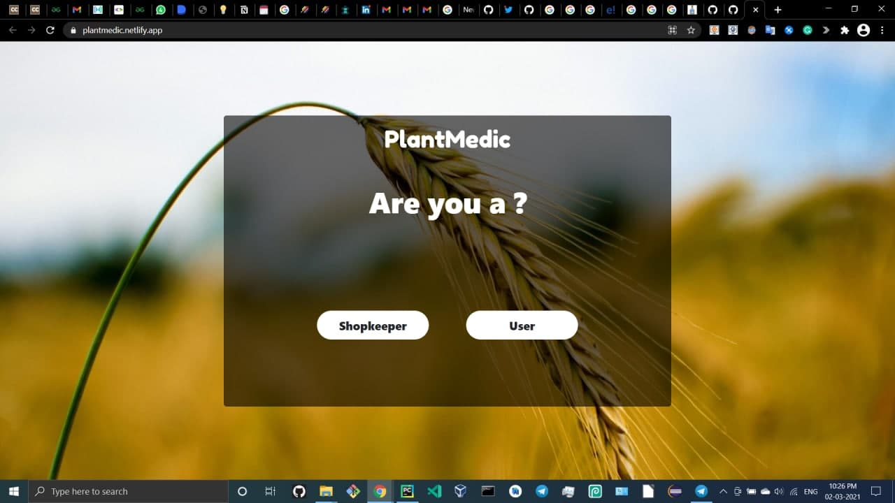
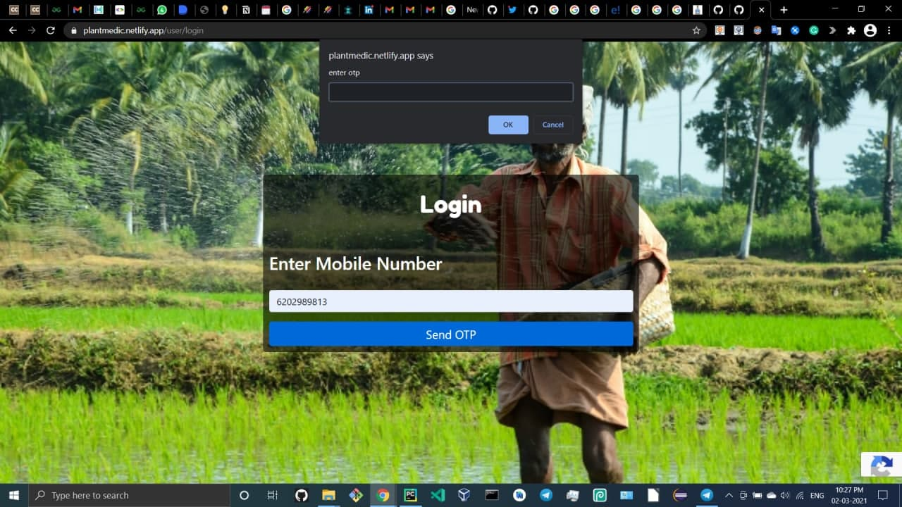
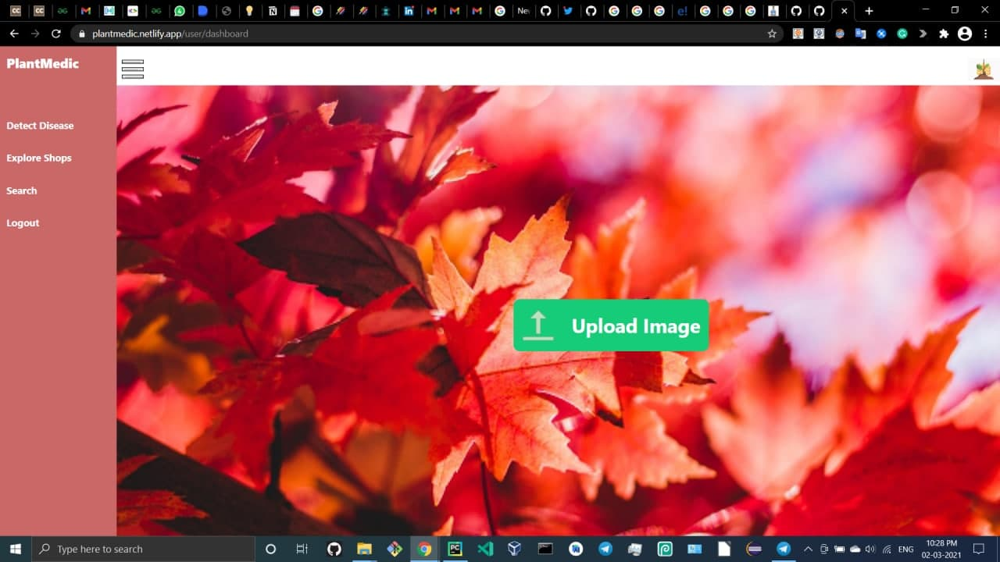
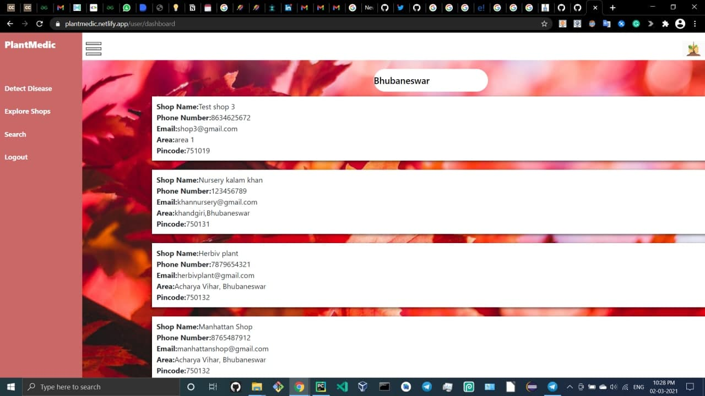

# PlantMedic-Web-App

A Web App built for Crops, disease, Weeds, Pest and Nutrient-deficiency detection. Shows nearby shopkeepers filters features.

[https://plantmedic.netlify.app/](https://plantmedic.netlify.app/)

## Key-features:
- Online Crops,  disease, weeds, pests and nutrient-deficiency detection.
- User registration features.
- Nearby shopkeeper display features.
- Shopkeeper Registration features.
- Online Encyclopedia for Crops and disease detection.

## Technologies Used:
- HTML, CSS, Javascript
- Firebase Auth, Firebase Realtime Database, Storage
- Python- Flask, tensorflow, os, pillow, numpy
- Tensorflow- keras

## Web-App ScreenShots:

1. **User and Shopkeeper Home Page :**

2. **User Login using firebase-Authentication :**

3. **Shopkeeper Registration Features :**

4. **User Dashboard :**

5. **Nearby Shopkeeper filters based on Locations :**

