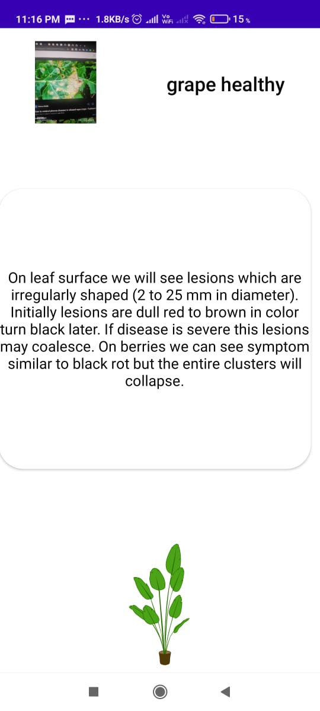

# PlantMedic App

This is the project developed for trithon-2021 for the Problem Statement below.  
**PS Title:** Identification of crops, weeds, diseases and pest damage and nutrient deficiency symptoms Development of an app for identification of crops, weeds, diseases and pest damage and nutrient deficiency symptoms.   
**PS Description:** The app should have user selection features such that: Item to identify ? Crop, Weed, Pest damage, disease damage, nutrient deficiency. The app should have access to the device?s camera. The developers should have an extensive database of photos of Crops, weeds, and other plants, trees, symptoms in the leaves that have been caused by pests, diseases and also typical examples of major and minor nutrient deficiency symptoms. The app should have the algorithms for object detection, and image classification Pattern recognition algorithms should be developed to provide a close match for all possible inputs and further get the most likely matching of the inputs. There can also be a pattern matching algorithms, to look for exact matches in the input with pre-existing patterns.  

## Screen-Shots of Mobile App :   
1. **UI for choosing language :**   

2. **add Homepage :**  

3. **Machine Learning Classification Models Menu :**  

4. **Crops and disease detection :**   

5. **Crops Selection and Crop disease Encyclopedia feature :**

## Team Members:
1. Sunanda Samantaray(Lead)
2. Abhinandan Roul
3. Anshuman Mohapatra
4. Sourav Bera
5. Subhraprasad Padhy

